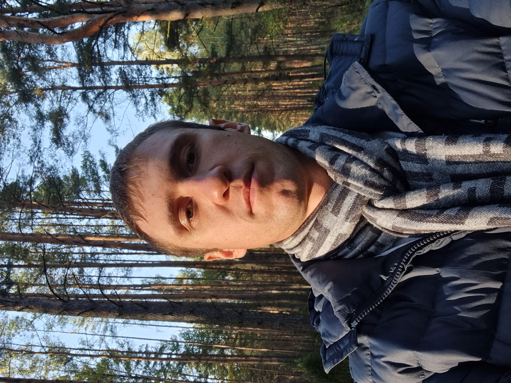

**Andrei Zaretski**
## Contacts

  * __Place of residence:__ _city of Minsk, Frunzensky district_                
  * __phone number:__ _+375297758106_                                        
  * __Emeil:__ _zaretskiag@gmail.com_                            
  * __GitHub:__ _https://github.com/AndreiZaretski_                               
  * __Linkedin:__  _https://www.linkedin.com/in/AndreiZaretski/_ 
  * __Discord RS-school nickname:__ _Andrei Zaretski#8487_

## About me

   * __Date of Birth:__ _11.05.1988_

   * __Career objective:__ _Junior Front-end Developer_
   * __Objectives:__ _New field of activity, development, training._

   * __Scills:__
     + __Hard skills:__ _HTML, CSS, JavaScript, Angular, HTML5-API, Github, git, DOM, wordpress._
     + __Soft skills:__ ability to learn, time planning, ability to work in a team, attention to detail, stress resistance.


## Code example

      ```<script>
        let tab = document.createElement('table');     
        let tb = document.createElement('tbody');       
        let n = 1, i, j;
        let col = 6;
        let row = 8;
        for (i=1; i<=row; i++) {
            let tr = document.createElement('tr');
            setTimeout(function(){tr.remove()}, 6000);
            for (j=1; j<=col; j++) {
            let td1 = document.createElement('td');
            tr.appendChild(td1); 
            td1.innerHTML = `Ячейка ${n++}`; 
           setTimeout(function(){td1.innerHTML=""}, 2000); 
            setTimeout(function(){td1.remove()}, 4000);
        }
        tb.appendChild(tr); }
        tab.append(tb);
        document.body.append(tab);  
        setTimeout(function(){tb.remove()}, 8000);
        setTimeout(function(){tab.remove()}, 10000);
        </script>```
    

## Work experience:
    August 2011 - March 2022 - JSC "Mostostroy" branch of MSU6 - master of construction
     and installation works, foreman, job superintendant. Main responsibilities: 
     management of the construction process, negotiations with the customer, general 
     contractor, subcontractor, supervisory authorities, keeping records of working 
     hours, materials, machines and mechanisms, etc.

## My work example

  https://andreizaretski.github.io/mySite/


##  Education:
   * BNTU, faculty of transport communications “Bridges, transport tunnels and subways”, “Construction”, university graduation years  2011, 2012.
   * BNTU, Faculty of Civil Engineering, postgraduate study “Building materials and products”, year of graduation 2017.
   * Belhard - “Website development basics”, “Modern Front-End with  JavaScript and HTML5”- 2022.


## Foreign language skills:
* __English:__ A1, but I’m learning it at the moment;
* __Italian:__  A2, 
* __French:__ A1.

